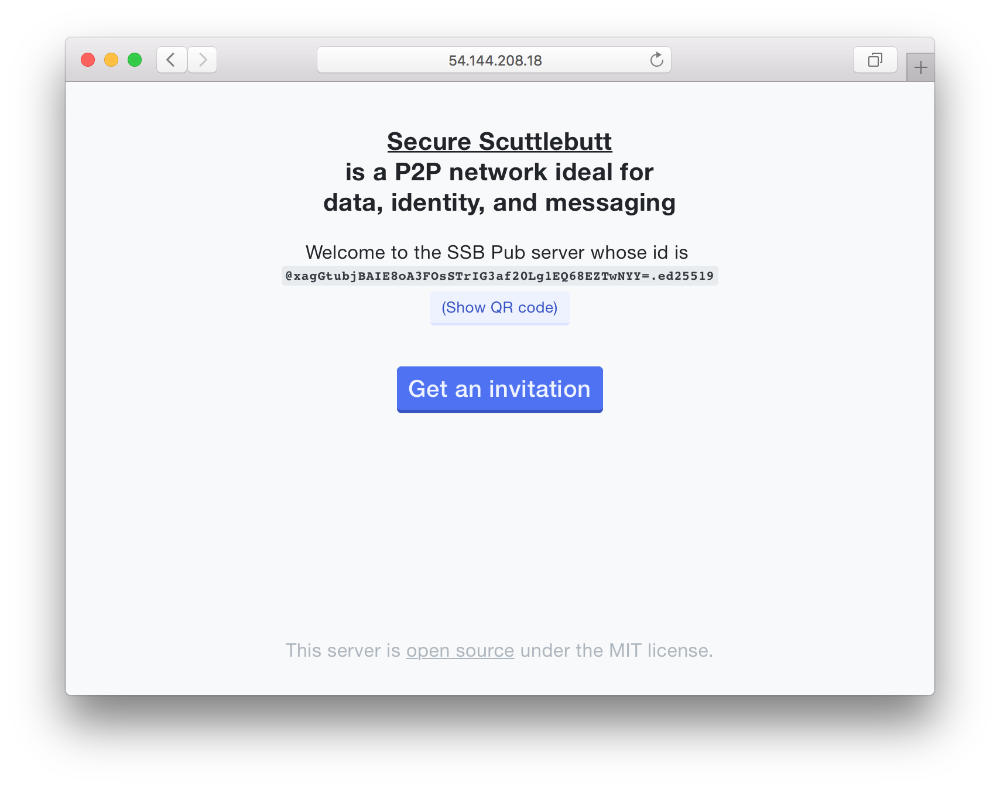

# Easy Secure Scuttlebutt Pub

> `easy-ssb-pub` is an easy-to-host server that runs an SSB "Pub".



[Secure Scuttlebutt](https://scuttlebutt.nz) (SSB) is an impressive peer-to-peer network that can be used for metadata, identity, and particularly, messaging. SSB is an ideal protocol for a social network. There is already a social network on SSB, called [Patchwork](https://github.com/ssbc/patchwork).

However, to join the wider SSB network, you must get a dedicated invitation from a "Pub" server. Also, hosting a Pub server is not the easiest task. In order to improve adoption of SSB, this project makes it easy to deploy an SSB Pub. Once the Pub is running, it has a light frontend page where anyone can get freely request a fresh invitation.

## Visit one of these

Check the [Pub Registry](https://github.com/ssbc/scuttlebot/wiki/Pub-Servers).

## How to deploy

You will need a server that supports a TCP sockets on ports 80, 8008 and 8007. This means [Heroku](https://heroku.com/) or [Zeit Now](https://zeit.co/now) will *not* work. Recommended services for servers-on-demand: [Digital Ocean Docker Droplet](https://www.digitalocean.com/products/one-click-apps/docker/), [UpCloud](https://upcloud.com/), [Amazon LightSail](https://amazonlightsail.com/), [Vultr](https://vultr.com/), [Linode](https://www.linode.com), etc.

1. Acess your server via shell (e.g. SSH)
2. Install [Docker](https://docs.docker.com/engine/installation/) and [Docker Compose](https://docs.docker.com/compose/install/)
3. `git clone https://github.com/staltz/easy-ssb-pub.git`
4. `cd easy-ssb-pub`
5. `HOST=publicurltoyourserv.er docker-compose up -d`
6. Open `http://publicurltoyourserver.er` in your browser

After the container has been created, stop/start/restart the server using:

* `docker stop easy-ssb-pub`
* `docker start easy-ssb-pub`
* `docker restart easy-ssb-pub`

### OR

1. Access your server via shell (e.g. SSH)
2. `docker pull staltz/easy-ssb-pub`
3. `docker run -e "HOST=publicurltoyourserv.er" -v $HOME/.ssb:/root/.ssb -p 80:80 -p 8008:8008 -p 8007:8007 -m 450M --memory-swap 1G --restart=unless-stopped --name ssb-pub -d staltz/easy-ssb-pub`

### OR

1. Access your server via shell (e.g. SSH)
2. `apt-get install -y libleveldb-dev curl libc6 libcurl3 zlib1g libtool autoconf`
3. Install nvm: `curl -o- https://raw.githubusercontent.com/creationix/nvm/v0.33.0/install.sh | bash`
4. Restart the shell
5. `nvm install v6.9.1`
6. `git clone https://github.com/staltz/easy-ssb-pub.git`
7. `cd easy-ssb-pub`
8. `npm install`
9. `HOST=publicurltoyourserv.er npm start`

## How to debug

Sometimes it is useful to see what the easy-ssb-pub server is doing. When starting the server, provide the environment variable:

```
DEBUG='*'
```
